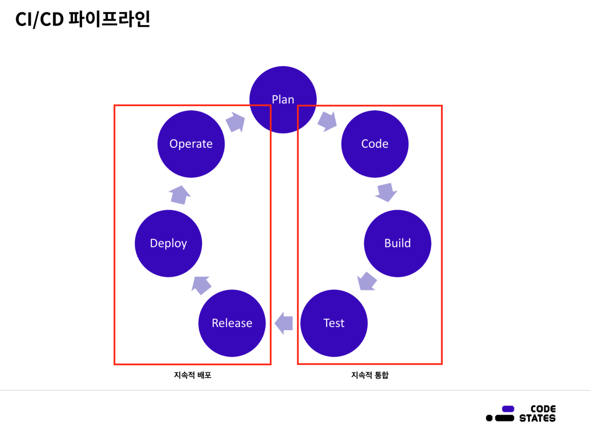

# 배포자동화 파이프 라인  
  
1. Source 단계: Source 단계에서는 원격 저장소에 관리되고 있는 소스 코드에 변경 사항이 일어날 경우, 이를 감지하고 다음 단계로 전달하는 작업을 수행합니다.  

2. Build 단계: Build 단계에서는 Source 단계에서 전달받은 코드를 컴파일, 빌드, 테스트하여 가공합니다. 또한 Build 단계를 거쳐 생성된 결과물을 다음 단계로 전달하는 작업을 수행합니다.  

3. Deploy 단계: Deploy 단계에서는 Build 단계로부터 전달받은 결과물을 실제 서비스에 반영하는 작업을 수행합니다.  
  
## CI(지속적 통합)와 CD(지속적 배포)  
  

### CI(Continuous integration)  
팀 구성원이 각자의 작업을 자주 통합하는 소프트웨어 개발 방식입니다.  
크게 세가지 단계로 나뉘는데  
1. Code: 개발자가 코드를 코드 저장소에 Push
2. Build: 코드 저장소로부터 코드를 가져와 Build
3. Test: 코드 빌드의 결과물이 다른 컴포넌트와 잘 통합되는지 확인  

지속적 통합은 모든 코드 변화를 하나의 리포지토리에서 관리하는 것 부터 시작합니다.  
잦은 풀 리퀘스트(pull request)와 머지(merge)로 코드를 자주 통합함으로    
보안 이슈, 에러 등을 쉽게 파악할 수 있어 해당 이슈를 빠르게 개선할 수 있습니다.  
지속적 통합이 적용된 개발팀은 훨씬 더 효율적인 개발을 할 수 있게 됩니다.  

### CD(Continuous Delivery, Continuous Deployment)  
지속적 배포는 지속적 통합 과정이 원활하게 끝나면 바로 고객에게 배포하는 것입니다.  
1. Release: 릴리즈 단계에서는 빌드까지 모두 준비가 되었고, 어떤 기능이 개발되었는지 비즈니스 관계자들과 이야기를 나누는 단계.  
어떤 기능을 넣을지, 해당 릴리즈는 배포를 할지 말지 결정하는 단계로 여러 의사결정이 이루어짐  
2. Deploy: 실제 배포  
3. Operation: 배포된 소프트웨어를 실제 운용하는 과정.  
해당 과정에서 고객의 피드백을 충분히 받아 기획에 반영.  

최근에는 고객의 피드백을 빨리 받아보기 위해서라도,  
서비스를 중단하지 않기 위해서라도 버전 릴리즈만 잘 기록해두고 바로바로 배포하는 사례가 증가하고 있습니다