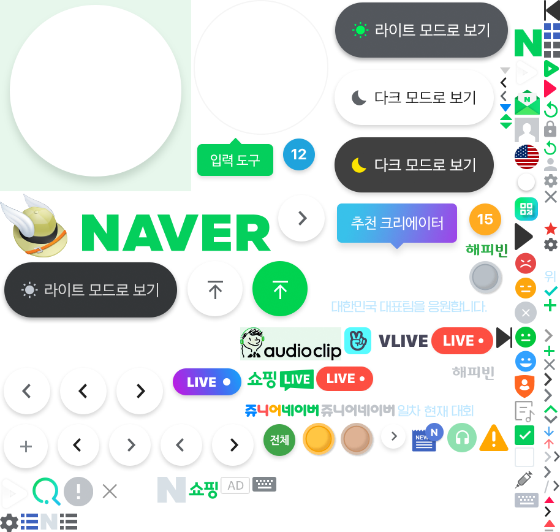
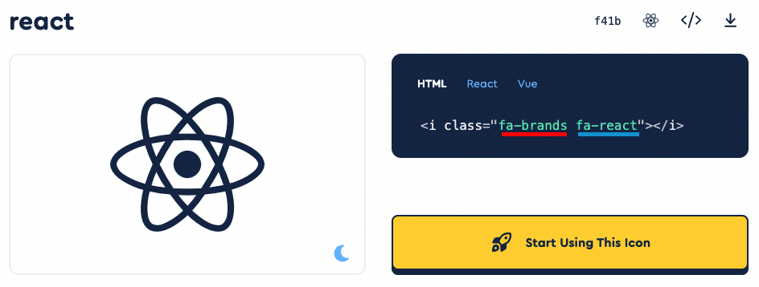
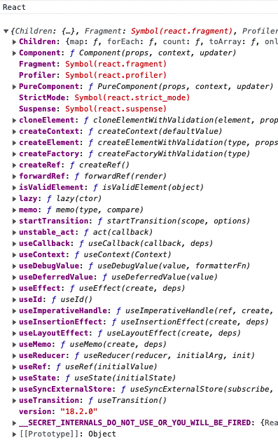
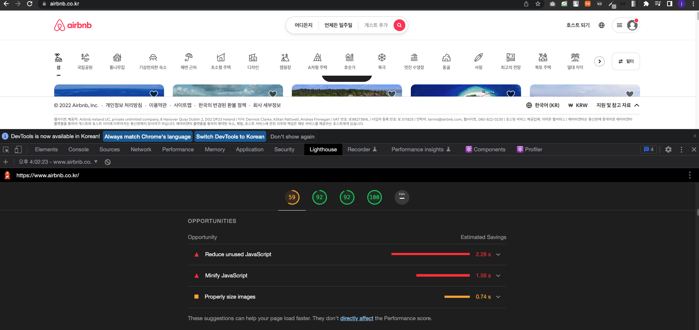
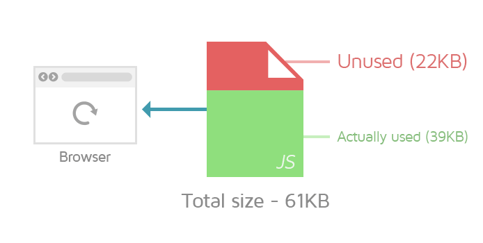
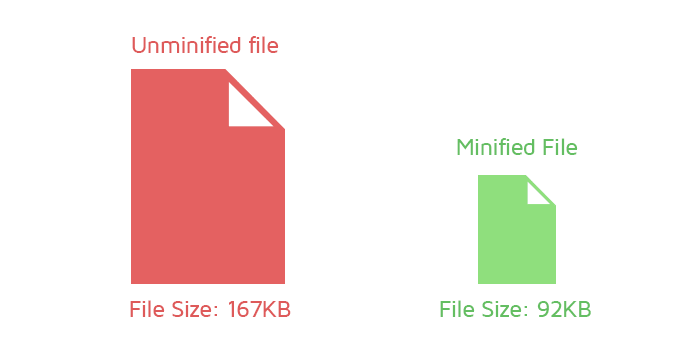
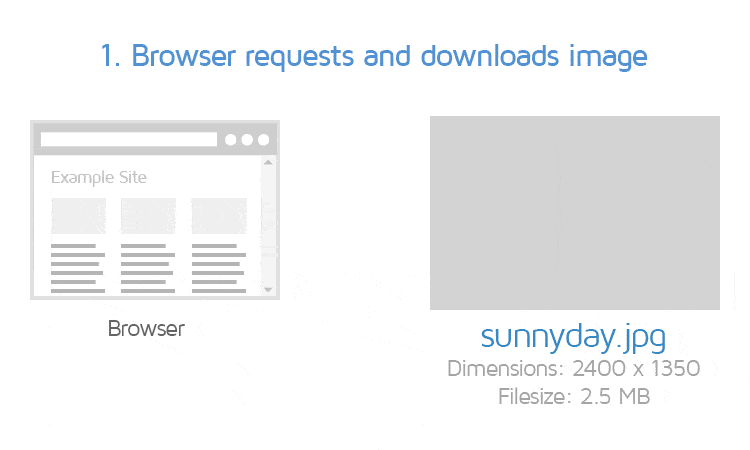

# Optimization

주어진 상황에서 최선의 결과를 얻을 수 있도록 처리하는 과정  
컴퓨터 공학에서는 적은 리소스를 소모하여 가능한 빠르게 원하는 결과를 얻을 수 있도록 하는 것을 의미합니다.  

## 필요성 및 효과   
* 이탈률 감소  
최적화가 잘 되어있지 않은 웹 페이지는 화면 로딩에 시간이 걸릴 수 있습니다.  
화면을 불러오는 시간이 길어지면 사용자가 페이지를 이탈할 확률이 높아집니다.  
이는, 웹사이트 최적화를 통해 로딩 속도를 줄이면,  
사용자의 이탈률을 효과적으로 줄일 수 있다는 의미이기도 합니다.  
* 전환률 증가  
전환률이란, 웹사이트 방문자 중 회원가입, 구매, 게시글 조회, 다운로드 등의 행위를 한 사용자의 비율을 의미합니다.  
* 수익 증대  
빠른 웹사이트 로딩 속도는 수익 증대로 이어질 가능성이 있습니다.  
이탈률 감소와 전환률 증가는 곧 트래픽 증대와 회원 수 증가로 이어질 수 있습니다.
* UX 향상  


## HTML, CSS 코드 최적화 방법

### HTML  
* DOM 트리 가볍게 만들기  

```javascript
// 수정 전
<div>
	<ol>
		<li> 첫 번째 </li>
		<li> 두 번째 </li>
		<li> 세 번째 </li>
	</ol>
</div>

// 수정 후 : 불필요한 div 요소 제거
<ol>
	<li> 첫 번째 </li>
	<li> 두 번째 </li>
	<li> 세 번째 </li>
</ol>
```  
* 인라인 스타일 지양하기  
```javascript
//수정 전
<div style="margin: 10px;"> 마진 10px </div>
<div style="margin: 10px;"> 이것도 마진 10px </div>

//수정 후 : class와 CSS로 대체
<div class="margin10"> 마진 10px </div>
<div class="margin10"> 이것도 마진 10px </div>

.margin10 {
	margin: 10px;
}
```  

### CSS

* 사용하지 않는 CSS제거하기  
* 간결한 셀렉터 사용하기  
```javascript
// 복잡한 CSS 셀렉터 예시
.cart_page .cart_item #firstItem { ... }

// 필요한 경우에는 어쩔 수 없지만, 가능한 한 간결하게 작성해줍니다.
.cart_item { ... }
```  

## 리소스 로딩 최적화 하기

* CSS 파일 불러오기  
```javascript
// CSS 파일은 HTML 파일 상단의 head 요소 안에서 불러오는 것이 좋습니다.
<head>
	<link href="style.css" rel="stylesheet" />
</head>
```  

* JavaScript 파일 불러오기  
```javascript
<body>
	<div>...</div>
	...

	// JavsScript 파일은 body 요소가 닫히기 직전에 작성하는 것이 가장 좋습니다. 
	<script src="script.js" type="text/javascript"></script>
</body>
```  

## 브라우저 이미지 최적화하기  
* 이미지 스프라이트  
브라우저의 모든 이미지들을 각각 서버에 요청할 경우 웹사이트의 로딩 시간이 늘어나게 됩니다.  
이를 해결하기 위해 이미지 스프라이트를 사용합니다.  
이미지 스프라이트는 여러개의 이미지를 모아 하나의 스프라이트 이미지로 만들고 CSS의 `background-position` 속성을 사용해 이미지의 일정 부분만 클래스 등으로 구분하여 사용하는 방법입니다.  

  
(네이버에 접속한 후 개발자 도구를 이용해 살펴본 스프라이트 이미지)

* Font Awesome 사용하기  
```javascript
// 핵심 패키지 설치
npm i --save @fortawesome/fontawesome-svg-core

// 아이콘 패키지 설치 (해당 코드는 무료 아이콘들입니다. 유료 아이콘을 사용할 경우 추가로 설치가 필요합니다.)
npm i --save @fortawesome/free-solid-svg-icons
npm i --save @fortawesome/free-regular-svg-icons
npm i --save @fortawesome/free-brands-svg-icons

// Font Awesome React 구성 요소 설치
npm i --save @fortawesome/react-fontawesome@latest
```
설치 후에는 Font Awesome 사이트에서 사용하고 싶은 아이콘의 정보를 확인한 후에, 알맞게 불러와서 사용하면 됩니다. 이때 아이콘 이름은 camelCase로 작성해야 합니다.  


이렇게 불러온 아이콘은 클래스명을 직접 붙이거나 Font Awesome이 정해준 방법을 사용하여 스타일링해줄 수 있습니다.  

* WebP 또는 AVIF 이미지 포맷 사용하기  
이미지 최적화를 위해 전통적으로 사용하는 JPEG 또는 PNG 형식이 아닌 새롭게 등장한 이미지 포맷인 WebP 또는 AVIF를 사용하여 용량을 더욱 감소시킬 수 있습니다.  
WebP는 PNG와 비교해 26% 용량이 감소되며 JPEG와 비교했을 땐 25-35% 더 감소됩니다.  
AVIF는 JPEG와 비교했을 때 무려 용량의 50%가 감소되며 WebP와 비교했을 땐 20% 감소됩니다.  

## 캐시 사용하기  
캐시는 다운로드 받은 데이터나 값을 미리 복사해 놓는 임시 장소를 뜻하며,  데이터에 접근하는 시간이 오래 걸리는 경우나 값을 다시 계산하는 시간을 절약하고 싶은 경우에 사용합니다. 캐시를 사용하면 리소스를 매번 다운로드받을 필요 없이 캐시에서 꺼내와 재사용하면 되기 때문에 네트워크 리소스는 물론 로딩 시간을 줄일 수 있습니다.  
프론트엔드단에서 캐시를 사용하기 위해서는 HTTP 요청을 보낼 때 조건부 요청 헤더를 작성하여 캐시를 재사용해도 되는지 확인해주면 됩니다.  
`If-Modified-Since` : 캐시된 리소스의 Last-Modified 값 이후에 서버 리소스가 수정되었는지 확인하고, 수정되지 않았다면 캐시된 리소스를 사용합니다.  
`If-None-Match` : 캐시된 리소스의 ETag 값과 현재 서버 리소스의 ETag 값이 같은지 확인하고, 같으면 캐시된 리소스를 사용합니다.  
보통 두 종류의 헤더를 동시에 사용합니다. 둘 중 하나만 사용했다가 매칭되는 응답 헤더가 없는 경우에는 재사용할 수 있는 경우에도 리소스를 다시 받아와야 하는 경우가 생길 수 있기 때문입니다.  

## CDN 사용하기  
CDN은 콘텐츠를 좀 더 빠르고 효율적으로 제공하기 위해 설계되었습니다.  
네트워크 지연(latency)은 유저와 호스팅 서버간의 물리적 거리의 한계가 존재하기 때문에 발생할 수 밖에 없습니다.  
유저와 서버의 거리가 멀다면 지연(latency) 또한 늘어납니다.  
CDN은 이를 해결하고자 세계 곳곳에 분포한 분산된 서버에 콘텐츠를 저장합니다.  

간단히 말해, CDN은 유저가 가까운 곳에 위치한 데이터 센터(서버)의 데이터를 가져옵니다.  
그러므로 데이터가 전달되기 위해 거쳐야하는 서버의 갯수가 크게 줄기 때문에 로딩 속도가 빨라집니다.

## Tree Shaking  
말그대로 나무를 흔들어 잔가지를 털어내듯 불필요한 코드를 제거하는 것을 의미합니다.  
* 필요한 모듈만 import 하기  
예를 들어 React를 통째로 볼러온 후 `console.log`를 사용해 확인해보면  
```javascript
import React from `react`;

function App() {
    console.log("React")
    console.log(React)
}
```
  
이렇게 모든 코드가 불려옵니다.  
이를 방지하기 위해 `import`할 때 아래와 같이 사용할 코드만 불러옵니다.  

```javascript
import { useState, useEffect } from 'react'
```  
* Babelrc 파일 설정하기  
Babel은 자바스크립트 문법이 구형 브라우저에서도 호환이 가능하도록 ES5 문법으로 변환하는 라이브러리입니다.  
이 때 ES5문법은 import를 지원하지 않기 때문에 commonJS 문법의 require로 변경시키는데, 이 과정은 트리쉐이킹에 큰 걸림돌이 됩니다.  
require는 export 되는 모든 모듈을 불러오기 때문입니다.  
앞서 작성한 것처럼 필요한 모듈만 불러오기 위한 코드를 작성해도 소용이 없어지는 것입니다.  
이를 방지하기 위해서 Barbelrc 파일에 다음과 같은 코드를 작성해주면 ES5로 변환하는 것을 막을 수 있습니다.  
```javascript
{
  “presets”: [ 
    [
      “@babel/preset-env”,
      {
	    "modules": false
      }
    ]
 ]
}
```  
`modules`값을 `true`로 설정하면 ES5 문법으로 변환하기 때문에 주의해야합니다. 

* sideEffects 설정하기  
웹팩은 사이드 이펙트를 일으킬 수 있는 코드의 경우, 사용하지 않는 코드라도 트리쉐이킹 대상에서 제외시킵니다.  
이럴 때 package.json 파일에서 sideEffects를 설정하여 사이드 이펙트가 생기지 않을 것이므로 코드를 제외시켜도 됨을 웹팩에게 알려줄 수 있습니다.  
다음과 같이 작성하면 애플리케이션 전체에서 사이드 이펙트가 발생하지 않을 것이라고 알려줍니다.  
```javascript
{
  "name": "tree-shaking",
  "version": "1.0.0",
  "sideEffects": false
}
```  
혹은 아래와 같이 작성하여 특정 파일에서는 발생하지 않을 것임을 알려줄 수 있습니다.  
```javascript
{
  "name": "tree-shaking",
  "version": "1.0.0",
  "sideEffects": ["./src/components/NoSideEffect.js"]
}
```  
* ES6 문법을 사용하는 모듈 사용하기  

## Ligthouse(Oppertunities)  
Lighthouse는 구글에서 개발한 오픈소스로서 웹 페이지의 품질을 개선할 수 있는 자동화 툴입니다.  
Lighthouse는 성능, 접근성, PWA, SEO 등을 검사하며 이를 이용해 사용자는 어떤 웹페이지든 품질 검사를 할 수 있습니다.  

* 개선 방향 잡기  
Lighthouse는 성능을 측정할 뿐 아니라 무엇이 시간을 많이 소모하는지,  
어떻게 개선하여 최적화를 할 수 있을지 해결책도 제시해줍니다.  
Opportunities 항목을 확인하면 각 메트릭별 문제를 확인할 수 있습니다.  
다음은 에어비앤비에서 Lighthouse를 실행하고 Oppertunity를 확인한 결과입니다.  
  
각 항목마다 어떤 해결 방법이 있는지 알아보겠습니다.  
1. Reduce unused JavaScript  
사용하지 않는 JavaScript를 줄여 페이지 로드 속도와 UX를 개선할 수 있습니다.  
사용하지 않는 자바스크립트란 중요하지 않은 코드와 더 이상 사용되지 않는 코드를 말합니다.  

2. Minify JavaScript  
js payload와 메인 스레드 차단 시간을 줄이기 위한 최적화 기술입니다.  
주석, 공백 및 중복 코드를 제거하여 js파일 크기를 줄이는 데 도움이 될 수 있으며 경우에 따라 더 짧은 변수 및 함수 이름을 사용하여 코드를 더 효율적으로 만듭니다.  
js 파일 크기/페이로드가 작을수록 페이지 로드 속도가 빨라지고 UX가 향상됩니다.  
  
3. Properly size images  
페이지에 게재되는 이미지는 적절한 크기여야 합니다.  
가장 흔한 문제는 이미지의 해상도가 엄청난 크기로 업로드 되는 것입니다.  
이미지 크기를 적절하게 조정하면 페이지 로드와 UX 경험을 향상시킬 수 있습니다.  
이는 더 적은 양의 셀룰러 데이터를 필요로하기 때문에 모바일 디비이스에서 더욱 가치있습니다.
  

<https://gtmetrix.com/>  
위 링크를 방문하면 다양한 Oppertunity와 해결방법을 학습할 수 있습니다.

